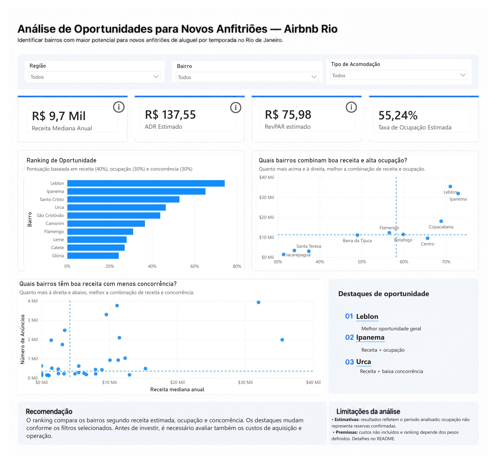
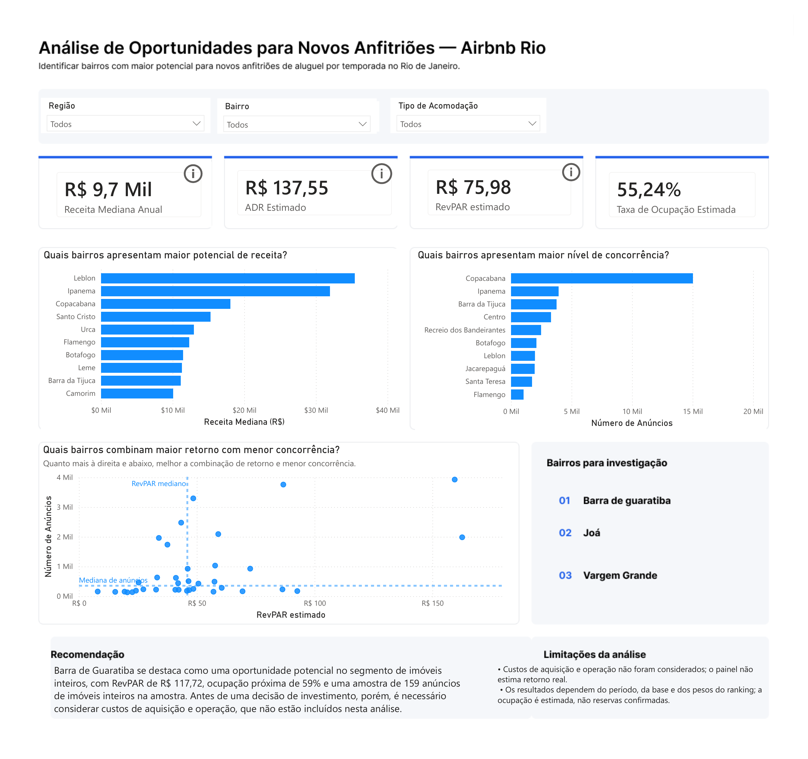

# Análise de Oportunidades para Novos Anfitriões — Airbnb Rio

Projeto de análise de dados desenvolvido no **Power BI** com dados públicos do **Inside Airbnb** para identificar bairros do Rio de Janeiro com potencial para novos anfitriões de locação de curta temporada.

A análise combina três dimensões principais — **receita estimada, ocupação e concorrência** — para comparar bairros sob diferentes perspectivas e apoiar uma triagem inicial de oportunidades.

**Tecnologias:** Power BI • Power Query • DAX • Git • GitHub

[Ver dashboard em PDF](03-visualizacoes/analise-final.pdf) • [Arquivo Power BI](02-powerbi/airbnb-rio-analise-final.pbix) • [Dicionário de dados](04-documentacao/dicionario-de-dados.xlsx)

O dashboard foi desenvolvido em duas camadas:

- **Visão Simplificada:** leitura rápida dos principais indicadores, ranking e destaques de oportunidade.
- **Visão Analítica:** exploração mais detalhada das relações entre receita, ocupação e concorrência.

## Dashboard

### Visão Simplificada

### Principais achados

- **Leblon** aparece como a melhor oportunidade geral no cenário padrão do modelo.
- **Ipanema** se destaca pela combinação entre receita estimada e ocupação.
- **Urca** apresenta uma combinação favorável entre receita e menor pressão competitiva.

> O ranking é uma ferramenta de triagem e depende dos filtros e dos pesos atribuídos a receita, ocupação e concorrência.

---

## Objetivo do Projeto

Identificar quais bairros do Rio de Janeiro apresentam melhores oportunidades para novos anfitriões de locação de curta temporada, considerando:

- potencial de receita;
- ocupação estimada como indicador de demanda;
- pressão competitiva.

O objetivo é transformar os dados públicos do Airbnb em informações úteis para apoiar decisões de entrada e expansão no mercado de hospedagem de curta duração.

---

## Critérios de Sucesso

A versão entregue do projeto contempla:

- Identificação de bairros com maior potencial de receita estimada;
- Comparação entre demanda e pressão competitiva;
- Construção de um ranking de oportunidades para novos anfitriões;
- Análise dos bairros sob diferentes perspectivas de desempenho;
- Apresentação de orientações para investigações adicionais;
- Documentação das limitações metodológicas e das incertezas dos dados.

---

## Problema de Negócio

Um novo anfitrião interessado no mercado de locação de curta temporada no Rio de Janeiro precisa decidir **quais bairros merecem uma investigação antes de iniciar sua operação**.

Entretanto, uma receita estimada elevada não significa necessariamente uma oportunidade favorável. É preciso considerar também a demanda e a quantidade de anúncios concorrentes.

**Pergunta central da análise:**

Quais bairros apresentam o equilíbrio mais favorável entre receita estimada, ocupação e pressão competitiva?

> **Limite da análise:** o projeto identifica sinais de oportunidade de mercado, mas não calcula o retorno real sobre o investimento, pois não inclui custos de aquisição, financiamento e operação do imóvel.

---

## Hipóteses Iniciais

Antes da construção do dashboard, foram definidas algumas hipóteses para orientar a exploração dos dados.

1. **Zona Sul com alta receita e alta concorrência**

   Bairros como Copacabana e Ipanema tendem a apresentar receitas elevadas devido à forte demanda turística, mas também enfrentam maior pressão competitiva.

2. **Menor saturação pode compensar menor receita**

   Bairros menos turísticos podem apresentar faturamento inferior aos destinos tradicionais, porém oferecer oportunidades devido ao menor número de anúncios concorrentes.

3. **Imóveis inteiros apresentam maior potencial de receita**

   Anúncios classificados como casa ou apartamento inteiro tendem a gerar receitas superiores às de quartos privados ou compartilhados.

4. **Avaliações podem estar associadas à ocupação**

   Bairros ou anúncios com melhores avaliações dos hóspedes podem apresentar maiores taxas de ocupação.

5. **Existem oportunidades além dos bairros turísticos tradicionais**

   Alguns bairros podem apresentar um equilíbrio mais favorável entre receita, ocupação e concorrência, tornando-se alternativas interessantes para novos anfitriões.

---

## Perguntas de Negócio

### 1. Potencial de Receita

- Quais bairros apresentam maior receita estimada?
- Como ADR, RevPAR e tipo de acomodação ajudam a compreender as diferenças de desempenho?

### 2. Ocupação Estimada e Demanda

- Quais bairros apresentam maior ocupação estimada?
- O que a comparação com o calendário de disponibilidade permite investigar?

### 3. Pressão Competitiva

- Quais bairros concentram mais anúncios?
- Quais combinam receita relevante com menor pressão competitiva?
- Uma concorrência elevada implica necessariamente menor ocupação?

### 4. Oportunidades para Novos Anfitriões

- Quais bairros apresentam melhor equilíbrio entre receita, ocupação e concorrência?
- Como o Índice de Oportunidade altera a interpretação obtida ao observar somente receita?
- Quais mercados merecem investigação adicional?

**Questões exploratórias não concluídas nesta versão:** sazonalidade, associação entre avaliações e ocupação e superioridade sistemática de determinados tipos de acomodação.

## Escopo da Análise

Para evitar comparações pouco representativas, o ranking principal considera apenas bairros com **pelo menos 100 anúncios** na base analisada.

Os bairros são avaliados principalmente por três dimensões:

- **Receita:** capacidade de geração de receita estimada.
- **Demanda:** representada pela ocupação estimada.
- **Concorrência:** representada pelo número de anúncios ativos.

O projeto identifica sinais de oportunidade no mercado de hospedagem, mas não substitui uma análise completa de investimento imobiliário.

---

## Dados Utilizados

Os dados são públicos e foram obtidos no **Inside Airbnb**, referentes ao município do Rio de Janeiro.

A coleta utilizada no projeto corresponde a **24 de junho de 2026**.

**Fonte oficial:** [Inside Airbnb — Get the Data](https://insideairbnb.com/get-the-data/).

Os arquivos CSV de maior volume não foram incluídos no repositório GitHub. Para reproduzir a análise, utilize as bases `listings` e `calendar` referentes à coleta do Rio de Janeiro de 24/06/2026.

O [dicionário de dados](04-documentacao/dicionario-de-dados.xlsx) documenta as variáveis utilizadas no projeto.

### `listings.csv`

Base principal da análise, com **48.713 anúncios**.

Entre as variáveis utilizadas estão:

- identificador do anúncio;
- bairro;
- latitude e longitude;
- tipo de acomodação;
- capacidade;
- quartos e camas;
- preço da diária;
- avaliações;
- disponibilidade;
- receita estimada nos últimos 365 dias;
- ocupação estimada nos últimos 365 dias.

### `calendar.csv`

Base complementar com a disponibilidade diária dos anúncios.

O calendário utilizado cobre aproximadamente um ano:

**26/06/2026 a 25/06/2027**

Ele foi usado principalmente para investigar a disponibilidade e compreender as limitações da métrica de ocupação estimada.

---

## Controle de Qualidade dos Dados

Durante o projeto, foi identificado um problema de compatibilidade entre uma versão inicial do `calendar.csv` e a base de anúncios.

Ao comparar os identificadores dos anúncios entre as duas tabelas, nenhuma correspondência foi encontrada.

Uma nova versão do `calendar.csv`, correspondente à coleta de **24/06/2026**, foi então obtida no Inside Airbnb. Após a substituição, os identificadores da base principal passaram a encontrar correspondência no calendário.

Esse processo foi importante para evitar a utilização de bases pertencentes a coletas incompatíveis.

---

## Preparação dos Dados

A limpeza e transformação foram realizadas principalmente no **Power Query**.

As principais etapas incluíram:

- seleção das colunas relevantes;
- definição dos tipos de dados;
- limpeza do campo de preço;
- conversão das variáveis numéricas;
- renomeação das colunas para português;
- tradução das categorias de tipo de acomodação;
- padronização dos nomes dos bairros;
- tratamento de inconsistências de grafia e acentuação;
- construção de uma dimensão de região;
- validação dos relacionamentos entre as tabelas.

### Padronização dos bairros

Foram encontradas diferenças de escrita entre os nomes dos bairros, incluindo:

- diferenças de acentuação;
- grafias diferentes;
- bairros presentes na tabela de anúncios, mas ausentes inicialmente na dimensão de região.

Essas inconsistências foram corrigidas antes da utilização dos filtros por região.

---

## Modelo de Dados

O modelo foi estruturado utilizando as seguintes tabelas:

- `fato_anuncios` — tabela principal com as informações dos anúncios;
- `calendar` — disponibilidade diária dos imóveis;
- `Dim região` — dimensão utilizada para classificar os bairros por região;
- `Medidas` — tabela dedicada à organização das medidas DAX.

### Relacionamentos principais

| Tabela de origem | Tabela relacionada | Cardinalidade |
|---|---|---|
| `Dim região[Bairro]` | `fato_anuncios[Bairro]` | 1 para muitos |
| `fato_anuncios[ID Anúncio]` | `calendar[listing_id]` | 1 para muitos |

A separação permite utilizar os filtros regionais nas análises dos anúncios e relacionar cada imóvel aos respectivos registros de disponibilidade no calendário.

---

## Métricas e KPIs

Os indicadores foram selecionados para analisar o desempenho dos bairros sob diferentes perspectivas.

### Receita Mediana Estimada

Representa a mediana da receita anual estimada dos anúncios no contexto selecionado.

A mediana foi priorizada para reduzir a influência de valores extremos e representar melhor o desempenho típico dos anúncios.

### ADR Estimado

O *Average Daily Rate* é utilizado como indicador do valor médio diário no modelo.

Sua interpretação deve considerar as características e limitações da base utilizada.

### Taxa de Ocupação Estimada

Calculada a partir da média da variável `estimated_occupancy_l365d` no contexto selecionado.

É uma estimativa produzida pelo Inside Airbnb, não uma observação direta de reservas confirmadas.

### RevPAR Estimado

Combina o valor da diária com a ocupação, permitindo avaliar as duas dimensões conjuntamente.

**Relação conceitual:**

`RevPAR = ADR × Taxa de Ocupação`

O indicador representa desempenho estimado, não lucro ou retorno sobre investimento.

### Número de Anúncios

Utilizado como aproximação da pressão competitiva em cada bairro.

Uma quantidade elevada de anúncios pode indicar maior concorrência, mas também pode estar associada à concentração de demanda. Por isso, o indicador não deve ser interpretado isoladamente.

---

## Índice de Oportunidade

Para comparar os bairros em múltiplas dimensões, foi criado um **Índice de Oportunidade**.

O índice combina:

- **Receita:** 40%;
- **Ocupação:** 30%;
- **Concorrência:** 30%.

### Fórmula conceitual

`Índice de Oportunidade = (0,40 × Score de Receita) + (0,30 × Score de Ocupação) + (0,30 × Score de Concorrência)`

**Interpretação dos pesos:** a distribuição de 40% para receita, 30% para ocupação e 30% para concorrência representa uma premissa metodológica definida neste projeto, não uma importância universal dessas variáveis.

Os scores permitem comparar os bairros relativamente ao conjunto selecionado. Portanto, os resultados podem mudar conforme os filtros aplicados. Um score elevado indica uma combinação favorável dentro do modelo, não garantia de rentabilidade.

Os componentes foram normalizados antes da combinação para permitir a comparação de variáveis em escalas diferentes.

### Score de Receita

Representa a posição relativa do bairro em relação à receita mediana estimada.

### Score de Ocupação

Representa a posição relativa do bairro em relação à taxa de ocupação estimada.

### Score de Concorrência

O número de anúncios foi transformado em um score no qual:

**menor concorrência → maior pontuação**

Como alguns bairros possuem quantidade de anúncios muito superior aos demais, foi utilizada transformação logarítmica antes da normalização para reduzir a influência de valores extremos.

---

## Critério de Elegibilidade

Para participar do ranking de oportunidades, o bairro precisa apresentar **pelo menos 100 anúncios no contexto analisado**.

Esse limite foi adotado para reduzir a instabilidade das comparações, especialmente em bairros com amostras muito pequenas.

Bairros abaixo do limite não recebem classificação no Índice de Oportunidade.

**Importante:** a exclusão não significa que esses bairros apresentam baixo potencial econômico, apenas que não atendem ao critério mínimo estabelecido para esta comparação.

---

## Interpretação do Ranking

O Índice de Oportunidade funciona como uma ferramenta de comparação e triagem inicial de bairros para novos anfitriões.

Sua interpretação considera três aspectos:

- **Receita:** maior potencial de geração de receita estimada.
- **Ocupação:** maior nível de utilização estimada dos imóveis.
- **Concorrência:** menor pressão competitiva recebe uma pontuação mais favorável, conforme a transformação utilizada no modelo.

O ranking é dinâmico: os resultados podem mudar conforme os filtros aplicados e dependem dos pesos definidos para cada dimensão.

Além da classificação geral, o dashboard apresenta duas perspectivas complementares: receita combinada com ocupação e receita combinada com concorrência.

**Um bairro na primeira posição não representa automaticamente o melhor investimento imobiliário.** A decisão exige também avaliação dos custos de aquisição, operação, regulamentação e características específicas do imóvel.

---

## Respostas às Perguntas de Negócio

### 1. Potencial de Receita

#### Quais bairros apresentam maior potencial de receita?

Os resultados mostram que bairros da Zona Sul aparecem entre os mercados com maior potencial de receita estimada.

No cenário padrão da Visão Simplificada, bairros como **Leblon e Ipanema** aparecem entre os principais destaques.

Entretanto, analisar somente receita pode ser enganoso, pois bairros com maior faturamento potencial também podem apresentar níveis elevados de concorrência.

#### Qual é o ADR estimado por bairro?

O ADR varia significativamente entre os bairros.

Bairros mais valorizados e com forte demanda turística tendem a apresentar tarifas diárias mais elevadas.

O ADR foi utilizado principalmente em conjunto com a ocupação para construir o RevPAR estimado.

#### Como o potencial de receita varia entre os tipos de acomodação?

O dashboard permite filtrar a análise por tipo de acomodação e comparar:

- imóvel inteiro;
- quarto privado;
- quarto compartilhado;
- quarto de hotel.

A tipologia altera de forma relevante os resultados observados.

Entretanto, esta versão do projeto não realizou um teste estatístico específico para determinar se imóveis inteiros apresentam receita sistematicamente superior às demais categorias em todos os bairros.

**Conclusão:** a pergunta pode ser explorada pelo dashboard, mas não foi respondida de forma conclusiva nesta versão.

#### Como a sazonalidade influencia a receita?

A sazonalidade não foi analisada em profundidade nesta versão do projeto.

O `calendar.csv` cobre aproximadamente um ano, mas foi utilizado principalmente para investigar disponibilidade e validar a integração entre as bases.

**Status: não avaliada de forma conclusiva.**

---

### 2. Ocupação Estimada e Demanda

#### Quais bairros apresentam maiores taxas de ocupação estimada?

A taxa de ocupação varia entre os bairros e foi utilizada como principal indicador de demanda no ranking.

Bairros com ocupação elevada não são necessariamente os melhores candidatos para novos anfitriões, pois também podem apresentar maior concorrência.

#### A indisponibilidade do calendário confirma a ocupação estimada?

Não diretamente.

Durante o projeto, a taxa de ocupação estimada foi comparada com a proporção de datas indisponíveis do `calendar.csv`.

Em bairros como Copacabana e Ipanema foram observadas diferenças relevantes entre as duas métricas.

Isso não significa necessariamente que a ocupação estimada esteja incorreta, pois:

- a ocupação do Inside Airbnb é uma estimativa;
- datas indisponíveis podem representar reservas;
- datas também podem ser bloqueadas pelo próprio anfitrião;
- as métricas possuem metodologias diferentes.

Portanto, a indisponibilidade foi utilizada como indicador complementar, e não como validação direta da ocupação estimada.

#### Existe relação entre avaliações e ocupação?

A hipótese foi considerada durante a definição inicial do projeto, mas não foi testada de forma suficientemente aprofundada para estabelecer uma conclusão confiável.

**Status: não avaliada de forma conclusiva.**

#### Existem bairros com boa demanda fora dos destinos turísticos tradicionais?

Sim.

A análise mostra que observar apenas os bairros turísticos mais conhecidos pode esconder mercados com combinações interessantes de ocupação, receita e menor concorrência.

---

### 3. Pressão Competitiva

#### Quais bairros concentram maior número de anúncios?

A quantidade de anúncios varia fortemente entre os bairros.

Destinos turísticos tradicionais apresentam maior concentração de imóveis, o que pode aumentar a pressão competitiva enfrentada por novos anfitriões.

#### Existe relação entre alta concorrência e menor ocupação?

Os dados permitem comparar as duas dimensões, mas não foi estabelecida uma relação causal entre concorrência e ocupação.

Um bairro pode apresentar simultaneamente:

- alta concorrência;
- alta ocupação;
- alta receita.

Portanto, concorrência elevada não deve ser interpretada automaticamente como baixa demanda.

#### Quais bairros combinam boa receita com menor concorrência?

Essa pergunta é representada diretamente no gráfico de:

**RevPAR estimado × número de anúncios**

O gráfico ajuda a identificar bairros posicionados mais à direita e abaixo, combinando:

- maior RevPAR estimado;
- menor número de anúncios.

Esses bairros são tratados como candidatos para investigação adicional, e não como recomendações automáticas de investimento.

---

### 4. Oportunidades para Novos Anfitriões

#### Quais bairros oferecem o melhor equilíbrio entre receita, ocupação e concorrência?

Para responder a essa pergunta, foi criado o **Índice de Oportunidade**.

No cenário padrão da Visão Simplificada, o dashboard destaca:

- **Leblon** — melhor oportunidade geral segundo o índice;
- **Ipanema** — destaque em receita + ocupação;
- **Urca** — destaque em receita + menor concorrência.

Esses resultados são dinâmicos e podem mudar quando o usuário altera os filtros de região, bairro ou tipo de acomodação.

#### O ranking muda a percepção obtida ao analisar apenas receita?

Sim.

Um bairro com receita elevada pode perder posições quando também apresenta:

- alta concorrência;
- menor ocupação relativa.

Da mesma forma, um bairro com receita um pouco menor pode subir no ranking ao apresentar:

- boa ocupação;
- menor pressão competitiva.

Esse é o principal valor do Índice de Oportunidade: evitar decisões baseadas em uma única métrica.

#### Quais bairros representam oportunidades pouco exploradas?

A análise identifica bairros que merecem investigação adicional quando apresentam combinações favoráveis de:

- RevPAR;
- ocupação;
- menor número de anúncios.

Esses bairros devem ser tratados como candidatos para uma segunda etapa de análise, incluindo custos imobiliários e operacionais.

---

## Validação das Hipóteses Iniciais

| Hipótese | Resultado | Interpretação |
|---|---|---|
| Zona Sul apresenta alta receita e alta concorrência | Parcialmente confirmada | Bairros da Zona Sul aparecem entre os destaques de receita, mas o nível de concorrência varia entre eles. |
| Bairros menos turísticos podem compensar menor receita com menor concorrência | Parcialmente confirmada | A análise encontrou bairros que ganham relevância quando a concorrência é considerada, mas isso não garante maior retorno financeiro. |
| Imóveis inteiros geram mais receita que quartos privados | Não avaliada de forma conclusiva | O dashboard permite a comparação, mas não foi realizado teste específico suficiente para confirmar a hipótese em toda a amostra. |
| Melhores avaliações estão associadas a maior ocupação | Não avaliada de forma conclusiva | A relação não foi testada de maneira suficiente para sustentar uma conclusão. |
| Existem bairros com melhor equilíbrio entre receita, ocupação e concorrência | Confirmada dentro do modelo | O Índice de Oportunidade identifica diferenças relevantes quando as três dimensões são analisadas conjuntamente. |

---

## Principais Resultados

A análise mostrou que avaliar bairros apenas pela receita estimada não é suficiente para identificar oportunidades para novos anfitriões.

Os principais resultados foram:

- bairros da Zona Sul aparecem com frequência entre os maiores níveis de receita e ocupação;
- mercados mais valorizados também podem apresentar maior pressão competitiva;
- alguns bairros ganham relevância quando receita, ocupação e concorrência são avaliadas em conjunto;
- o Índice de Oportunidade altera a leitura obtida quando se observa apenas faturamento;
- a concorrência precisa ser interpretada junto com a demanda;
- o uso da mediana reduziu a influência de valores extremos;
- a comparação com o `calendar.csv` mostrou que indisponibilidade e ocupação estimada não são métricas equivalentes.

---

## Recomendações

Com base nos resultados, recomenda-se utilizar o dashboard como uma ferramenta de triagem para identificar bairros que merecem investigação adicional.

### Aplicações práticas

- **Análise inicial:** utilizar o Índice de Oportunidade para identificar bairros com um equilíbrio favorável entre receita estimada, ocupação e concorrência.
- **Prioridade em receita e demanda:** consultar a perspectiva que combina receita e ocupação.
- **Atenção à competição:** utilizar a perspectiva de receita e concorrência para identificar alternativas com menor concentração relativa de anúncios.
- **Comparação regional:** aplicar os filtros para investigar oportunidades em diferentes regiões do Rio de Janeiro.

### Antes de uma decisão de investimento

Recomenda-se complementar os resultados com:

- custos de aquisição ou aluguel;
- despesas operacionais e tributárias;
- regulamentação aplicável à locação;
- sazonalidade da demanda;
- características e localização específica de cada imóvel.

**O dashboard não determina onde investir. Ele organiza evidências para tornar a investigação inicial mais estruturada.**

---

## Limitações da Análise

Os resultados devem ser interpretados considerando as seguintes limitações metodológicas:

- **Indicadores estimados:** receita e ocupação são estimativas disponibilizadas pelo Inside Airbnb, não registros financeiros ou reservas efetivamente confirmadas.
- **Disponibilidade do calendário:** datas indisponíveis podem representar reservas ou bloqueios realizados pelos anfitriões. Portanto, indisponibilidade não equivale diretamente à ocupação.
- **Recorte temporal:** os dados utilizados correspondem à coleta de 24/06/2026. Os resultados podem mudar em outros períodos.
- **Concorrência:** a quantidade de anúncios foi utilizada como aproximação da pressão competitiva, mas não representa todas as características da competição local.
- **Critério de elegibilidade:** bairros com menos de 100 anúncios não participam do ranking. Isso limita a comparação, mas não significa ausência de oportunidades nesses mercados.
- **Pesos do índice:** a distribuição 40% receita, 30% ocupação e 30% concorrência é uma premissa metodológica. Outras distribuições podem produzir classificações diferentes.
- **Custos não considerados:** o projeto não incorpora aquisição ou aluguel do imóvel, manutenção, tributação e demais despesas operacionais.

**Ressalvas adicionais:** a quantidade de anúncios não captura integralmente a competição local, pois desconsidera diferenças de qualidade, preço, avaliações, capacidade, disponibilidade e localização dentro de cada bairro. Além disso, as relações identificadas entre os indicadores são descritivas e exploratórias, não constituindo evidência de causalidade.

### Possíveis aprofundamentos

Uma próxima versão poderá incorporar custos imobiliários, análise detalhada de sazonalidade, comparação por tipologia de acomodação e testes de sensibilidade dos pesos do índice.

**Conclusão metodológica:** o ranking identifica sinais relativos de oportunidade de mercado, não a rentabilidade efetiva de um investimento.

---

## Ferramentas Utilizadas

- **Power BI Desktop** — modelagem, medidas, visualizações e dashboard;
- **Power Query** — limpeza, transformação e padronização dos dados;
- **DAX** — métricas, scores e ranking de oportunidade;
- **Figma** — desenvolvimento e ajuste do layout visual;
- **Inside Airbnb** — fonte dos dados públicos.

### Principais técnicas aplicadas

- tratamento e transformação de dados;
- modelagem relacional;
- criação de tabela dimensão;
- padronização de categorias;
- criação de medidas DAX;
- normalização de indicadores;
- construção de ranking multicritério;
- análise de receita, demanda e concorrência;
- validação de relacionamentos entre bases;
- construção de dashboards orientados a perguntas de negócio.

---

## Detalhamento do Dashboard

O dashboard foi dividido em duas páginas com objetivos diferentes.

### Visão Simplificada

A **Visão Simplificada** foi desenvolvida para permitir uma leitura rápida dos principais resultados.

Ela apresenta:

- filtros por região, bairro e tipo de acomodação;
- receita mediana anual;
- ADR estimado;
- RevPAR estimado;
- taxa de ocupação estimada;
- ranking de oportunidade;
- relação entre receita e ocupação;
- relação entre receita e concorrência;
- destaques dinâmicos de oportunidade;
- recomendação;
- limitações resumidas da análise.

---

### Visão Analítica

A **Visão Analítica** foi desenvolvida para permitir uma investigação mais detalhada dos resultados.

Ela permite explorar:

- receita estimada por bairro;
- ADR;
- RevPAR;
- ocupação estimada;
- número de anúncios;
- pressão competitiva;
- relação entre RevPAR e concorrência;
- bairros que merecem investigação adicional;
- diferenças entre tipos de acomodação e regiões.

Enquanto a Visão Simplificada prioriza a comunicação e a síntese dos resultados, a Visão Analítica permite investigar com maior profundidade as relações entre os indicadores de receita, ocupação e concorrência.

---

## Conclusão

O projeto demonstrou a importância de analisar receita, ocupação e concorrência conjuntamente, evitando comparações baseadas exclusivamente no faturamento estimado dos bairros.

A construção do **Índice de Oportunidade** permitiu transformar diferentes indicadores em uma ferramenta de triagem, oferecendo perspectivas complementares para novos anfitriões interessados no mercado de locação de curta temporada do Rio de Janeiro.

O desenvolvimento também evidenciou a importância da qualidade dos dados, especialmente por meio da identificação e correção de incompatibilidades entre as bases de anúncios e calendário.

**Principal entrega:** um dashboard executivo e analítico que organiza dados públicos, comunica resultados e apoia a identificação de mercados que merecem investigação adicional.

O projeto não determina onde investir, mas oferece uma estrutura baseada em evidências para apoiar decisões mais informadas.
